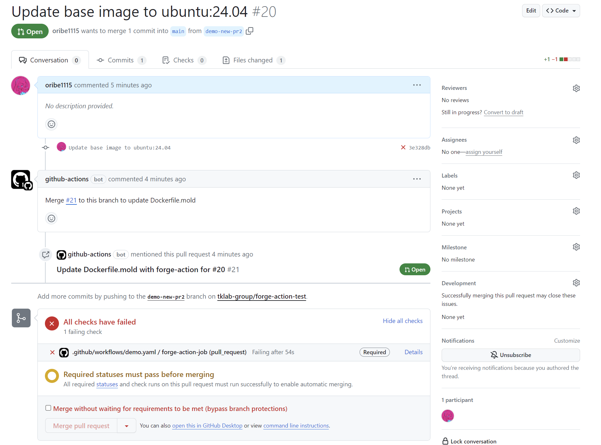
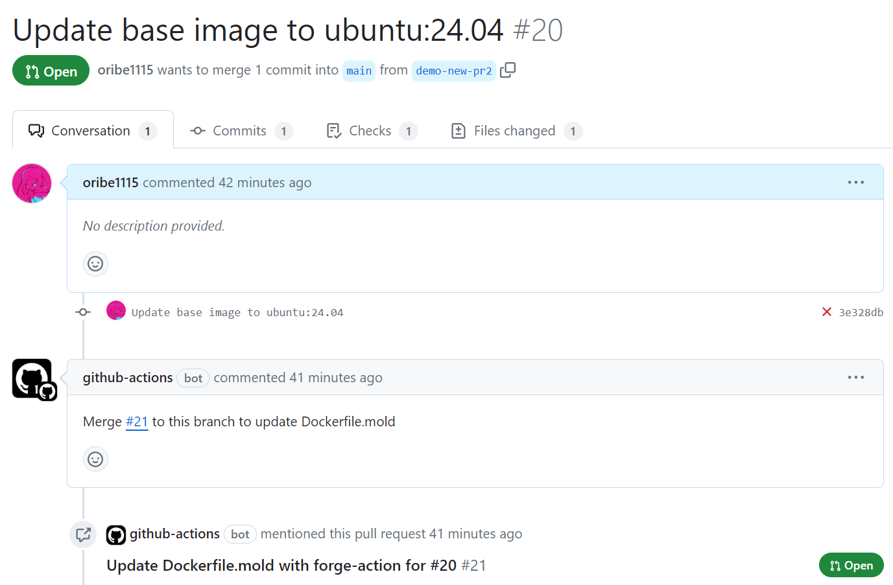
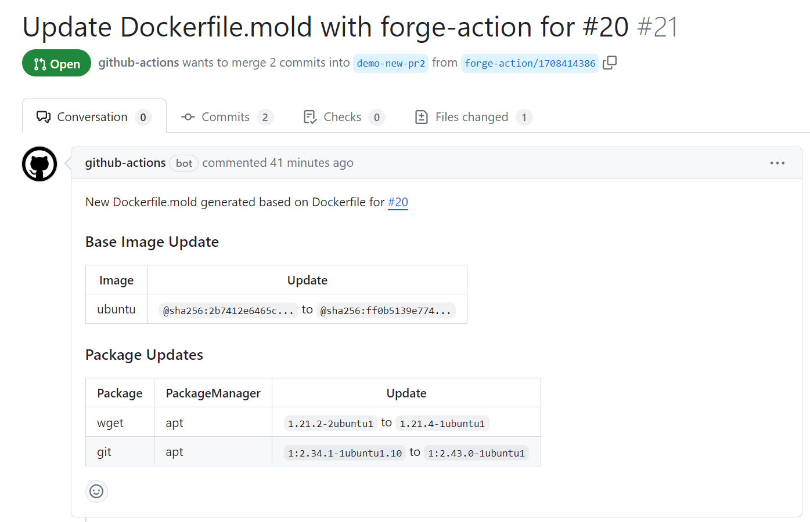
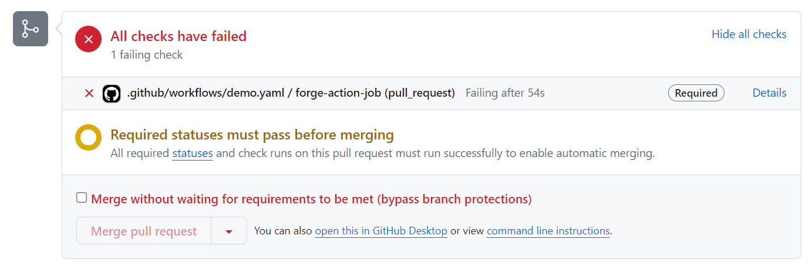
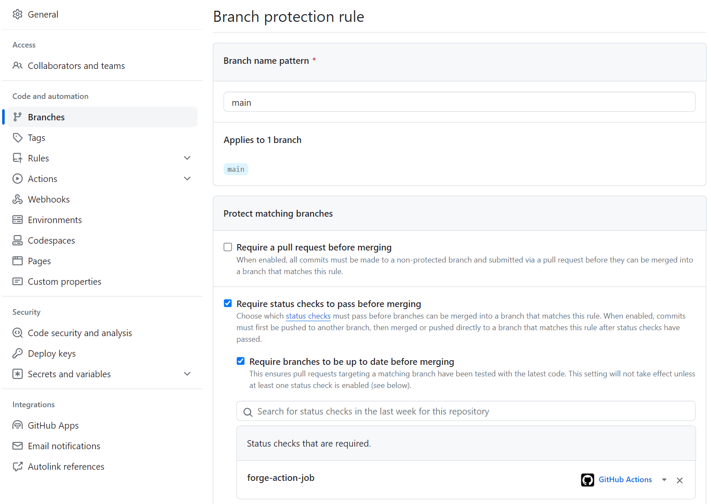
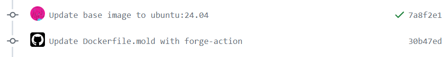

# forge-action

A GitHub Action to update Moldfile with [forge](https://github.com/tklab-group/forge).



## Usage

```yaml
    runs-on: ubuntu-latest
      - uses: actions/checkout@v4
      - uses: actions/setup-go@v4
      - uses: tklab-group/forge-action@v1
        with:
          build-context: '.'
          dockerfile: 'Dockerfile'
          moldfile: 'Dockerfile.mold'
          github-token: ${{ secrets.GITHUB_TOKEN }}
```

## Example

### Create a new PR for updating Moldfile

When you create a PR with editing Dockerfile, forge-action generates a new PR for updating Moldfile and notify it.

|              Base PR              |      Generated PR by forge-action      |
| :-------------------------------: | :------------------------------------: |
|  |  |

It's recommended to set a branch protection rule to block merging the base PR without updated Moldfile.



<details>
<summary>Recipe</summary>

```yaml
on:
  pull_request:
    paths:
      - Dockerfile

jobs:
  forge-action-job:
    runs-on: ubuntu-latest
      - uses: actions/checkout@v4
      - uses: actions/setup-go@v4
      - uses: tklab-group/forge-action@v1
        with:
          build-context: '.'
          dockerfile: 'Dockerfile'
          moldfile: 'Dockerfile.mold'
          update-style: 'new-pr'
          github-token: ${{ secrets.GITHUB_TOKEN }}
```

Set [a branch protection rule](https://docs.github.com/en/repositories/configuring-branches-and-merges-in-your-repository/managing-protected-branches/managing-a-branch-protection-rule) with the job.



</details>


### Update Moldfile when pushing modified Dockerfile

When you edit Dockerfile and push a working branch, forge-action directly commits the update for Moldfile on the branch.



<details>
<summary>Recipe</summary>

```yaml
on:
  push:
    - Dockerfile

jobs:
  forge-action-job:
    runs-on: ubuntu-latest
      - uses: actions/checkout@v4
      - uses: actions/setup-go@v4
      - uses: tklab-group/forge-action@v1
        with:
          build-context: '.'
          dockerfile: 'Dockerfile'
          moldfile: 'Dockerfile.mold'
          update-style: 'direct-commit'
          github-token: ${{ secrets.GITHUB_TOKEN }}
```
</details>


### Scheduled Moldfile update

Like dependabot, forge-action creates a PR to update Moldfile based on a schedule.

<details>
<summary>Recipe</summary>

```yaml
on:
  schedule:
    - cron: '0 0 0 0 1' # Every Monday

jobs:
  example:
    forge-action-job: ubuntu-latest
      - uses: actions/checkout@v4
      - uses: actions/setup-go@v4
      - uses: tklab-group/forge-action@v1
        with:
          build-context: '.'
          dockerfile: 'Dockerfile'
          moldfile: 'Dockerfile.mold'
          update-style: 'new-pr'
          github-token: ${{ secrets.GITHUB_TOKEN }}
```
</details>


## Action inputs

| Name                | Required | Default  |
| ------------------- | -------- | -------- |
| `version`           |          | `latest` |
| `working-directory` |          | `.`      |
| `build-context`     | true     |          |
| `dockerfile`        | true     |          |
| `moldfile`          | true     |          |
| `update-style`      |          | `new-pr` |
| `github-token`      | true     |          |


### `version`

The version of forge to use.

### `working-directory`

Working directory to run forge. 
The following inputs are treated as an relative path from `working-directory`.

- `build-context`
- `dockerfile`
- `moldfile`

### `build-context`

The path to build the base Dockerfile and the Moldfile.
e.g. `.`

### `dockerfile`

The base Dockerfile to generate the Moldfile.
e.g. `Dockerfile`

### `moldfile`

The target Moldfile to update.
e.g. `Dockerfile.mold`

### `update-style`

The way to update a Moldfile. Required.

#### `new-pr`

Create a new pull request with an updated Moldfile. 

If the triggered event is `pull_request`, the action creates a new pull request to the triggered branch and notifies it on the triggered pull request.

#### `direct-commit`

Create an update commit and push it on the triggered branch.


### `github-token`

Token to push a commit and create a pull request.
Set `GITHUB_TOKEN` or Personal Access Token (PAT).

e.g. `${{ secrets.GITHUB_TOKEN }}`

